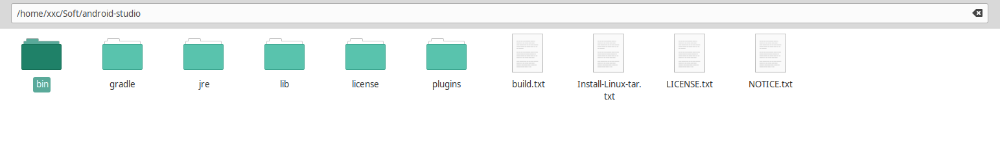
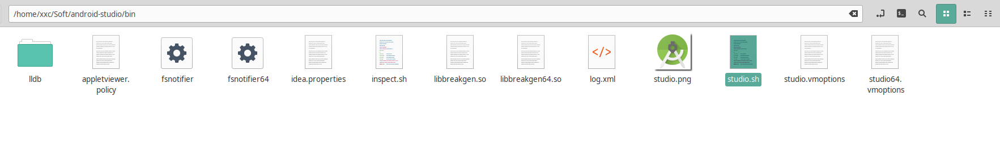
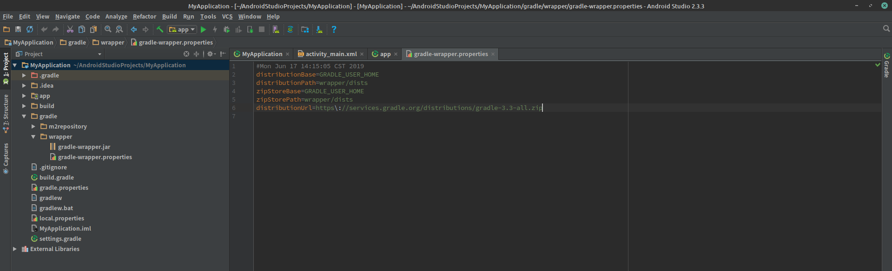
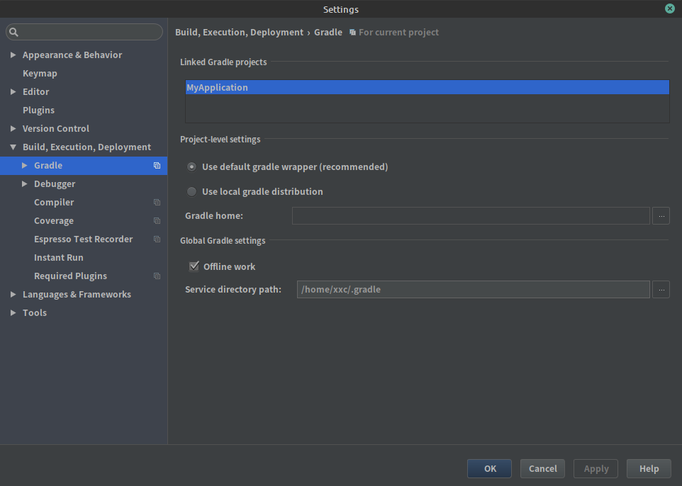
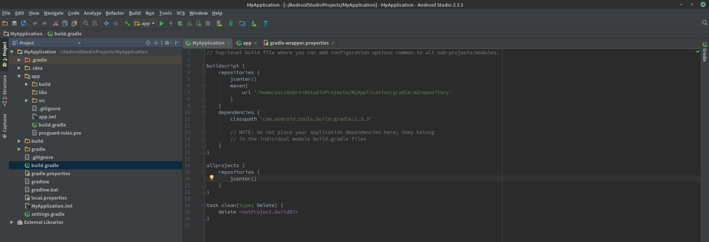
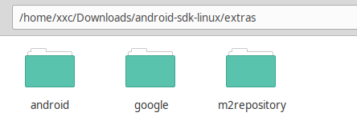
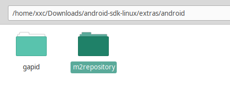
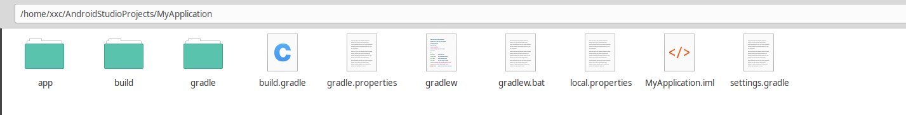
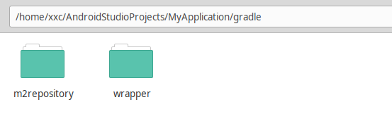

# 离线使用AS

## 一.安装Android Studio 软件

将安装包解压缩至特定的目录，如下图所示



> 需要提前安装Java7及其以上版本

## 二.首次打开Android Studio软件

1. 在AS所在的目录中找到"bin"目录，其文件目录如下所示



在此目录下打开终端,输入“./studio.sh”即可运行

```shell
./studio.sh
# 如果觉得每次打开麻烦可以在.bashrc(默认终端)文件中添加alias
```

2. 启动界面后创建一个项目，打开项目后将项目设置成Project模式(默认是Android),找到gradle文件下的gradle-wrapper.properties文件。



文件内容如下所示:

```groovy
#Mon Jun 17 14:15:05 CST 2019
distributionBase=GRADLE_USER_HOME
distributionPath=wrapper/dists
zipStoreBase=GRADLE_USER_HOME
zipStorePath=wrapper/dists
distributionUrl=https\://services.gradle.org/distributions/gradle-3.3-all.zip
```

> 从gradle-wrapper.properities文件中知道使用的构建工具gradle版本是3.3

设置构建工具：

1. 将gradl3.3-all.zip文件放在"~/.gradle/wrapper/dists/gradle-3.3-all/55gk2rcmfc6p2dg9u9ohc3hw9/gradle-3.3/"文件夹下，注意不要解压文件，其中在路径中有一串乱码，电脑不同，所以路径有些差别

2. 打开AS中的设置("File-settings..."),找到“Build,Exception,Deployment”下的Gradle菜单,将“offline work”勾选上
   
   

3. 返回主界面，在项目中的app-build.gradle文件中将其中多余的依赖删除；
   
   
   
   ```groovy
   apply plugin: 'com.android.application'
   
   android {
       compileSdkVersion 25        //编译版本
       buildToolsVersion '25.0.1'   //编译工具版本
       defaultConfig {
           applicationId "com.example.xxc.myapplication"
           minSdkVersion 19     
           targetSdkVersion 25
           versionCode 1
           versionName "1.0"
           testInstrumentationRunner "android.support.test.runner.AndroidJUnitRunner"
       }
       buildTypes {
           release {
               minifyEnabled false
               proguardFiles getDefaultProguardFile('proguard-android.txt'), 'proguard-rules.pro'
           }
       }
   }
   
   dependencies {
       compile fileTree(include: ['*.jar'], dir: 'libs')
       compile 'com.android.support:appcompat-v7:25.0.1'  //跟编译工具版本一致
       compile 'com.android.support.constraint:constraint-layout:1.0.2'
       //约束布局依赖，可以去掉,下面的各种测试依赖可以去掉
   }
   ```


4. 在Android SDK的文件中有一个名为extras的文件夹
   
   
   
   在android文件夹中有需要用到的m2repository文件夹：
   
   
   
   > 注意不要跟extras/m2repository文件夹弄混了，我们需要的是extras/android/m2repository文件夹
   
   将此文件夹复制到我们的项目所在的gradle目录下:
   
   
   
   

5. 打开项目的build.project文件，将其修改为本地依赖：
   
   
   
   将jcenter()注释掉，更换为本地的依赖；
   
   ```groovy
   // Top-level build file where you can add configuration options common to all sub-projects/modules.
   
   buildscript {
       repositories {
   //        jcenter() 
           maven{
               url '/home/xxc/AndroidStudioProjects/MyApplication/gradle/m2repository'
           }
       }
       dependencies {
           classpath 'com.android.tools.build:gradle:2.3.3'
   
           // NOTE: Do not place your application dependencies here; they belong
           // in the individual module build.gradle files
       }
   }
   
   allprojects {
       repositories {
   //        jcenter()
       }
   }
   
   task clean(type: Delete) {
       delete rootProject.buildDir
   }
   ```

6. 关闭项目，然后重新打开此项目，等待一段时间后即可实现AS离线编译
