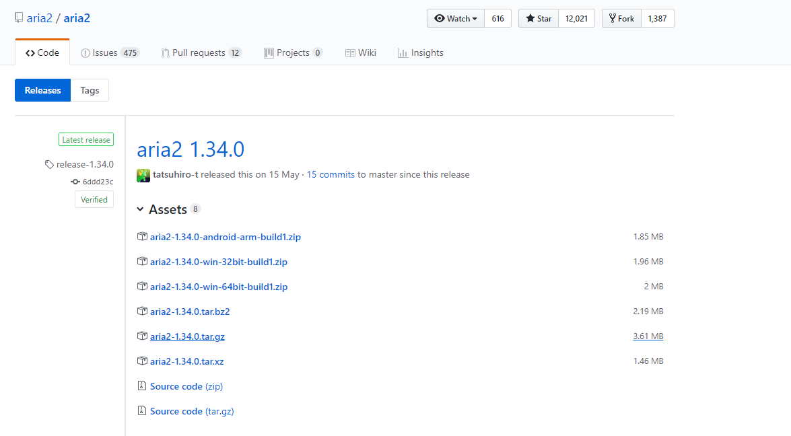
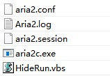
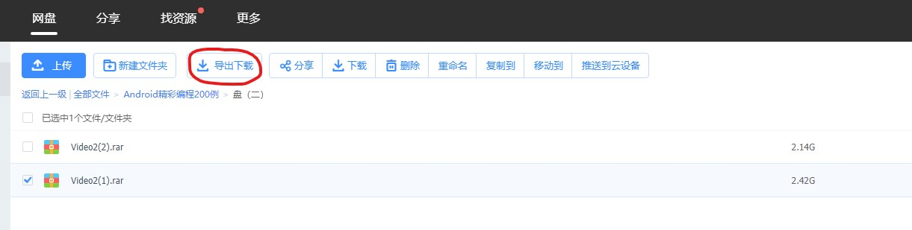
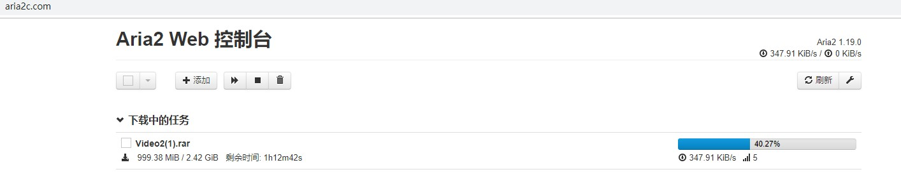

## 配置Aira2

### 1.Github搜索[aira2](https://github.com/aria2/aria2/releases),并下载



### 2.下载aira2.exe文件,新建四个文件



####  1.air2.conf (配置文件)

#### 2.Aria2.log (日志文件，空文件就行)

####  3.aria2.session (下载历史，空文件就行)

#### 4.HideRun.vbs （隐藏cmd窗口运行用到的）


### 3.文件配置


#### aria2.conf

```xml
dir=E:\Aira2Tool\Downloads\
log=E:\Aira2Tool\Aira2\Aria2.log
input-file=E:\Aira2Tool\Aira2\aria2.session
save-session=E:\Aira2Tool\Aira2\aria2.session
save-session-interval=60
force-save=true
log-level=error

# see --split option
max-concurrent-downloads=5
continue=true
max-overall-download-limit=0
max-overall-upload-limit=50K
max-upload-limit=20

# Http/FTP options
connect-timeout=120
lowest-speed-limit=10K
max-connection-per-server=15
max-file-not-found=2
min-split-size=1M
split=5
check-certificate=false
http-no-cache=true

# FTP Specific Options

# BT/PT Setting
bt-enable-lpd=true
#bt-max-peers=55
follow-torrent=true
enable-dht6=false
bt-seed-unverified
rpc-save-upload-metadata=true
bt-hash-check-seed
bt-remove-unselected-file
bt-request-peer-speed-limit=100K
seed-ratio=0.0


# Metalink Specific Options

# RPC Options
enable-rpc=true
pause=false
rpc-allow-origin-all=true
rpc-listen-all=true
rpc-save-upload-metadata=true
rpc-secure=false

# Advanced Options
daemon=true
disable-ipv6=true
enable-mmap=true
file-allocation=falloc
max-download-result=120
#no-file-allocation-limit=32M
force-sequential=true
parameterized-uri=true
```
>dir=D:\Download\ （下载文件保存路径，改为你想要的,不要带中文和空格）
>log=D:\App\Aria2\Aria2.log （日志文件，路径D:\App\Aria2\改为你安装aria2的路径）
>input-file=D:\App\Aria2\aria2.session
>save-session=D:\App\Aria2\aria2.session（这两个是记录和读取下载历史用的，断电和重启时保证下载任务不会丢失，如果有时aria2不能启动，清空这里面的内容就行了，路径D:\App\Aria2\改为你安装aria2的路径）
>max-connection-per-server=16(服务器的最大连接数)

贴一个在知乎上看到的详细说明配置
```xml
## '#'开头为注释内容, 选项都有相应的注释说明, 根据需要修改 ##
## 被注释的选项填写的是默认值, 建议在需要修改时再取消注释  ##

## 文件保存相关 ##

# 文件的保存路径(可使用绝对路径或相对路径), 默认: 当前启动位置
dir=~/downloads
# 启用磁盘缓存, 0为禁用缓存, 需1.16以上版本, 默认:16M
#disk-cache=32M
# 文件预分配方式, 能有效降低磁盘碎片, 默认:prealloc
# 预分配所需时间: none < falloc ? trunc < prealloc
# falloc和trunc则需要文件系统和内核支持
# NTFS建议使用falloc, EXT3/4建议trunc, MAC 下需要注释此项
#file-allocation=none
# 断点续传
continue=true

## 下载连接相关 ##

# 最大同时下载任务数, 运行时可修改, 默认:5
#max-concurrent-downloads=5
# 同一服务器连接数, 添加时可指定, 默认:1
max-connection-per-server=5
# 最小文件分片大小, 添加时可指定, 取值范围1M -1024M, 默认:20M
# 假定size=10M, 文件为20MiB 则使用两个来源下载; 文件为15MiB 则使用一个来源下载
min-split-size=10M
# 单个任务最大线程数, 添加时可指定, 默认:5
#split=5
# 整体下载速度限制, 运行时可修改, 默认:0
#max-overall-download-limit=0
# 单个任务下载速度限制, 默认:0
#max-download-limit=0
# 整体上传速度限制, 运行时可修改, 默认:0
#max-overall-upload-limit=0
# 单个任务上传速度限制, 默认:0
#max-upload-limit=0
# 禁用IPv6, 默认:false
#disable-ipv6=true
# 连接超时时间, 默认:60
#timeout=60
# 最大重试次数, 设置为0表示不限制重试次数, 默认:5
#max-tries=5
# 设置重试等待的秒数, 默认:0
#retry-wait=0

## 进度保存相关 ##

# 从会话文件中读取下载任务
input-file=/etc/aria2/aria2.session
# 在Aria2退出时保存`错误/未完成`的下载任务到会话文件
save-session=/etc/aria2/aria2.session
# 定时保存会话, 0为退出时才保存, 需1.16.1以上版本, 默认:0
#save-session-interval=60

## RPC相关设置 ##

# 启用RPC, 默认:false
enable-rpc=true
# 允许所有来源, 默认:false
rpc-allow-origin-all=true
# 允许非外部访问, 默认:false
rpc-listen-all=true
# 事件轮询方式, 取值:[epoll, kqueue, port, poll, select], 不同系统默认值不同
#event-poll=select
# RPC监听端口, 端口被占用时可以修改, 默认:6800
#rpc-listen-port=6800
# 设置的RPC授权令牌, v1.18.4新增功能, 取代 --rpc-user 和 --rpc-passwd 选项
#rpc-secret=<TOKEN>
# 设置的RPC访问用户名, 此选项新版已废弃, 建议改用 --rpc-secret 选项
#rpc-user=<USER>
# 设置的RPC访问密码, 此选项新版已废弃, 建议改用 --rpc-secret 选项
#rpc-passwd=<PASSWD>
# 是否启用 RPC 服务的 SSL/TLS 加密,
# 启用加密后 RPC 服务需要使用 https 或者 wss 协议连接
#rpc-secure=true
# 在 RPC 服务中启用 SSL/TLS 加密时的证书文件,
# 使用 PEM 格式时，您必须通过 --rpc-private-key 指定私钥
#rpc-certificate=/path/to/certificate.pem
# 在 RPC 服务中启用 SSL/TLS 加密时的私钥文件
#rpc-private-key=/path/to/certificate.key

## BT/PT下载相关 ##

# 当下载的是一个种子(以.torrent结尾)时, 自动开始BT任务, 默认:true
#follow-torrent=true
# BT监听端口, 当端口被屏蔽时使用, 默认:6881-6999
listen-port=51413
# 单个种子最大连接数, 默认:55
#bt-max-peers=55
# 打开DHT功能, PT需要禁用, 默认:true
enable-dht=false
# 打开IPv6 DHT功能, PT需要禁用
#enable-dht6=false
# DHT网络监听端口, 默认:6881-6999
#dht-listen-port=6881-6999
# 本地节点查找, PT需要禁用, 默认:false
#bt-enable-lpd=false
# 种子交换, PT需要禁用, 默认:true
enable-peer-exchange=false
# 每个种子限速, 对少种的PT很有用, 默认:50K
#bt-request-peer-speed-limit=50K
# 客户端伪装, PT需要
peer-id-prefix=-TR2770-
user-agent=Transmission/2.77
# 当种子的分享率达到这个数时, 自动停止做种, 0为一直做种, 默认:1.0
seed-ratio=0
# 强制保存会话, 即使任务已经完成, 默认:false
# 较新的版本开启后会在任务完成后依然保留.aria2文件
#force-save=false
# BT校验相关, 默认:true
#bt-hash-check-seed=true
# 继续之前的BT任务时, 无需再次校验, 默认:false
bt-seed-unverified=true
# 保存磁力链接元数据为种子文件(.torrent文件), 默认:false
bt-save-metadata=true
```
HideRun.vbs
```xml
CreateObject("WScript.Shell").Run "E:\Aira2Tool\Aira2\aria2c.exe --conf-path=aria2.conf",0
```
>E:\Aira2Tool\Aira2\aria2c.exe 改为你的aria2c.exe的绝对路径


### 4.使用


#### 1. 首先在谷歌浏览器或火狐浏览器上安装插件baiduexporter

#### 2.双击HideRun.vbs(必须先点击此脚本才可以)
#### 3.管理Aria 2 下载任务
. 打开Aria2 的[WebUI](http://aria2c.com/)
. 然后再页面的设置中将JSON-RPC Path设置为http://localhost:6800/jsonrpc
. 使用baiduexporter插件

. 使用网页管理下载


### 5.其它

同文件夹下有配置好的Aira2.7z压缩包，可以直接使用

