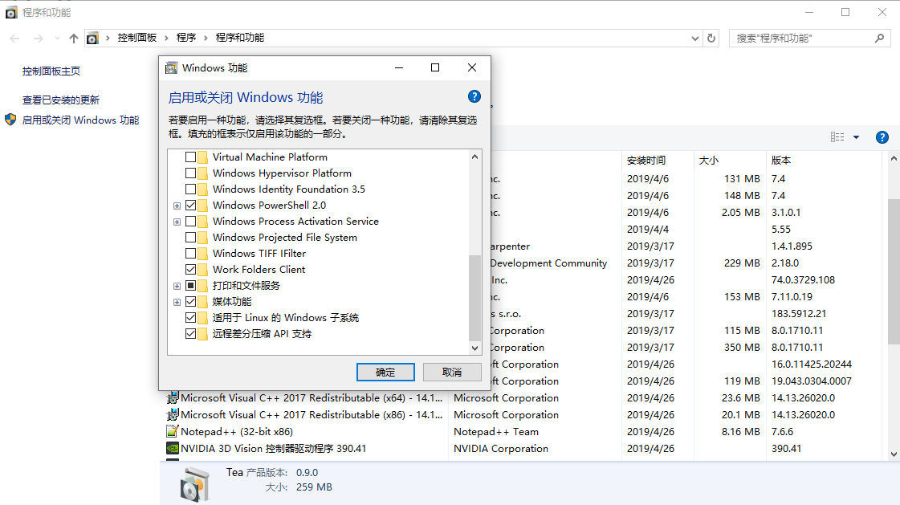
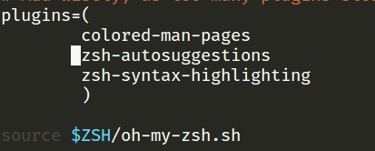
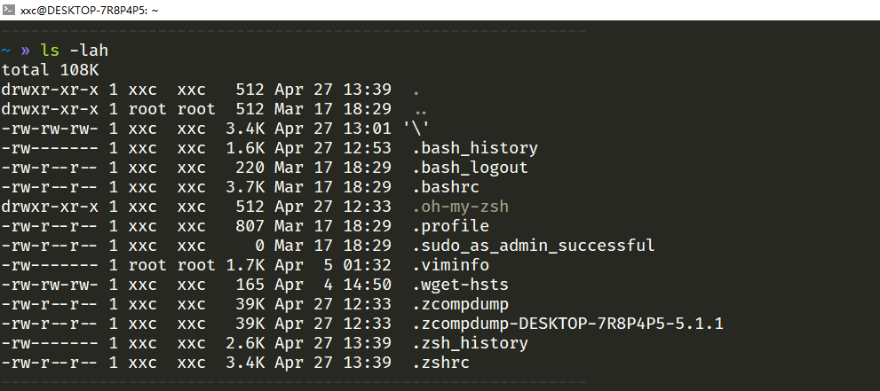

# Win10 linux 配置


WSL 是 Windows Subsystem for Linux 的简称，

zsh 是一个强大的 bash 替代，而 [oh-my-zsh](https://link.jianshu.com/?t=https://github.com/robbyrussell/oh-my-zsh) 是 zsh 的一个傻瓜化配置工具。


## 一.准备工作

1.win10开启Linux子系统

控制面板-->启动或关闭功能-->适用于Linux的Windows子系统



## 二.配置oh-my-zsh

1.下载zsh及oh-my-zsh

```shell
sudo  apt install zsh

sh -c "$(curl -fsSL https://raw.github.com/robbyrussell/oh-my-zsh/master/tools/install.sh)"

chsh -s /bin/zsh
```

> oh my zsh 目录详解
>
> lib 提供了核心功能的脚本库
> tools 提供安装、升级等功能的快捷工具
> plugins 自带插件的存在放位置
> templates 自带模板的存在放位置
> themes 自带主题文件的存在放位置
> custom 个性化配置目录，自安装的插件和主题可放这里

2.插件推荐

**zsh-syntax-highlighting**

shell高亮显示

```shell
git clone https://github.com/zsh-users/zsh-syntax-highlighting.git ${ZSH_CUSTOM:-~/.oh-my-zsh/custom}/plugins/zsh-syntax-highlighting
```

**zsh-autosuggestions**

命令行建议

```shell
git clone git://github.com/zsh-users/zsh-autosuggestions $ZSH_CUSTOM/plugins/zsh-autosuggestions
```

然后在.zshr中加上此插件名称



3.字体配置

在附件中可以安装FiraCode字体,可以更好的适用于oh-my-zsh的部分主题

[FiraCode字体下载](<https://raw.githubusercontent.com/tonsky/FiraCode/master/distr/ttf/FiraCode-Retina.ttf>)

4.主题推荐

我个人比较推荐使用af-magic主题



----


参考资料:1. [调教你的WSL终端](<https://www.jianshu.com/p/b147735ff3f2>)

​                2. [终端shell美化](<https://jyzhangchn.github.io/oh-my-zsh.html>)